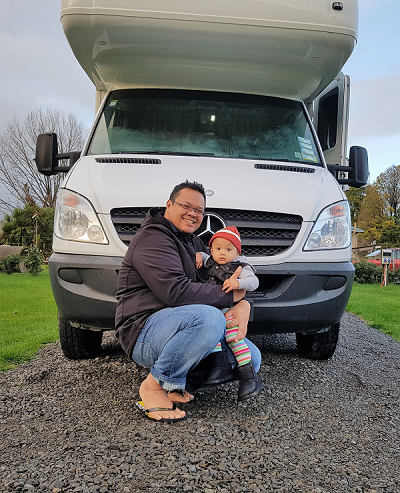

>### Mohd Nazrin Muhammad is a lecturer in the Department of Robotics And Automation, Faculty of Manufacturing Engineering, Universiti Teknikal Malaysia Melaka.

  

I envision a potential in Autonomous Guided Vehicle (AGV) for local industries, particularly in Melaka, Malaysia. I am working with a research team in Universiti Teknikal Malaysia Melaka (UTeM) to develop smart AGVs that apply accurate navigation techniques yet affordable for Small and Medium Industries (SMIs). Specifically, the research focuses on the interaction between AGVs and human to re-define the AGVs' navigations as the working environment changed.

I graduated from the [Islamic University of Malaysia (IIUM)](http://www.iium.edu.my/), Malaysia, with B. Eng. in Mechatronics in 2006. I worked as Test Development Engineer at Infineon Technologies (Malaysia) Sdn. Bhd., Melaka, from 2006-2007. Then I joined UTeM in 2007. In 2010, I graduated from the [University of Siegen](https://www.mechatronics.eti.uni-siegen.de/), Germany with a MSc. in Mechatronics. In 2013, I began working towards my PhD in Electrical and Electronics Engineering at the [University of Auckland](https://www.auckland.ac.nz/en/engineering/about-the-faculty/electrical-and-computer-engineering.html), New Zealand, where I am investigating an indoor pedestrian positioning and tracking using INS and RF sensor fusion under the supervision of [Prof Zoran Salcic](https://unidirectory.auckland.ac.nz/profile/z-salcic) and [Dr Kevin I-Kai Wang](https://unidirectory.auckland.ac.nz/profile/kevin-wang). I expect to graduate by the end of 2018.

My work involves a lot of programming and one particular language that worth to mention here is Java. Besides, I also an avid user of Matlab and learning to use R.
